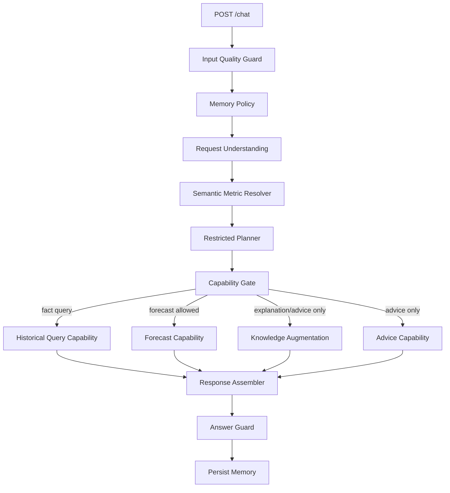

# Restricted Agent Pipeline Design

**Problem:** 当前 `doc-ai-agent` 已经具备可用的查询、预测、解释、建议能力，但核心职责仍然过度集中在 `QueryPlanner`、`DocAIAgent` 与隐式上下文继承中。对数据任务型 agent 来说，这会带来稳定性、业务口径一致性、事实边界与预测可靠性风险。

**Goal:** 在不破坏当前 `/chat` 请求/响应契约和 140 题严格评测门的前提下，把当前架构收敛成“受限数据任务流水线”，让语义口径、规划模板、能力准入、知识边界、记忆继承都变成显式且可审计的模块。

## Why this refinement is needed

- `QueryPlanner` 当前同时承担：
  - 理解补推
  - 规划与路由
  - `task_graph` 组织
  - 原因解释
  - 上下文追踪
- `RequestUnderstanding` 能识别意图、领域、窗口、地区，但缺少“业务指标口径层”。
- `run_knowledge_node()` 已只在解释/建议场景触发，但边界还主要靠约定，而不是显式策略。
- 预测能力已独立到 `forecast_service.py` / `forecast_engine.py`，但缺少“是否应该预测”的前置准入判断。
- 记忆层支持多轮继承，但还没有把“弱继承”和“禁止继承”的规则正式写成策略模块。

## Architecture options considered

### Option A: Keep the current architecture and continue patching edge cases

- **Pros**
  - 变更最小
  - 不需要新增模块
- **Cons**
  - planner 持续膨胀
  - 业务口径仍然分散
  - 针对乱问、跟进问、预测降级等问题仍会靠局部补丁维持

### Option B: Restricted data-task pipeline on top of the current LangGraph (**recommended**)

- **Pros**
  - 保留现有 LangGraph 主流程与契约
  - 把高风险职责拆成显式层
  - 适合当前“数据任务型 agent”，不是开放式通用 agent
- **Cons**
  - 需要经历一段“新旧边界并存”的过渡期

### Option C: Full DSL-first V2 runtime

- **Pros**
  - 理论上最稳定
  - 所有请求都先转成强约束 DSL
- **Cons**
  - 迁移成本过高
  - 容易影响当前严格评测与线上稳定性

## Recommended direction

采用 **Option B**：保留当前 LangGraph 主拓扑，但把核心逻辑重组为一条受限流水线：

1. **Input Quality Guard**
2. **Memory Policy**
3. **Request Understanding**
4. **Semantic Metric Resolver**
5. **Restricted Planner**
6. **Capability Gate**
7. **Capability Execution**
8. **Response Assembly**
9. **Answer Guard**
10. **Persistence**

## Target architecture

## Layer responsibilities

### 1. Input Quality Guard

- 目标：在最前面识别低信号、乱码、无领域信息、明显无效输入。
- 输出：
  - `is_valid_input`
  - `risk_level`
  - `clarification_prompt`
- 说明：
  - 这层只判断“是否值得继续理解”，不做业务路由。

### 2. Memory Policy

- 目标：统一多轮继承规则，避免记忆污染事实判断。
- 允许弱继承：
  - `region`
  - `time_window`
  - `domain`
  - `referent`
- 禁止继承：
  - 事实结论
  - 统计值
  - 排名结果
  - 预测结果
- 输出：
  - `inheritance_decision`
  - `inherited_slots`
  - `confidence`
  - `should_clarify`

### 3. Request Understanding

- 目标：只负责把用户问题转成统一语义状态。
- 负责：
  - 意图识别
  - 领域识别
  - 时间窗识别
  - 地区识别
  - 跟进问识别
  - `parsed_query` / `canonical_understanding`
- 不负责：
  - 业务指标口径定义
  - 自由任务图生成

### 4. Semantic Metric Resolver

- 目标：显式定义“自然语言业务指标 -> 标准查询口径”。
- 负责：
  - 指标口径
  - 维度映射
  - 时间粒度
  - 统计方法
  - 默认行为
- 典型规则：
  - “预警数” -> `metric=alert_count`, `aggregation=count`
  - “Top5” -> `ranking_basis=count` 或明确默认口径
  - “近一年” -> 滚动 12 个月或自然年，必须明确
  - “虫情趋势” -> 指定趋势指标，不允许隐式漂移

### 5. Restricted Planner

- 目标：把 planner 从“自由规划器”收紧为“模板选择器”。
- 只允许产出有限计划类型：
  - `fact_query`
  - `trend_query`
  - `ranking_query`
  - `forecast_query`
  - `explanation_query`
  - `advice_query`
  - `clarify_query`
- 输出：
  - `plan_type`
  - `required_slots`
  - `missing_slots`
  - `enabled_capabilities`
  - `response_mode`
- 明确不做：
  - 高自由度 `task_graph` 拼装
  - 再次自由语义推理

### 6. Capability Gate

- 目标：把“能不能执行某种能力”从 planner 中独立出来。
- 子策略包括：
  - `HistoricalQueryEligibility`
  - `ForecastEligibilityCheck`
  - `KnowledgePolicy`
  - `AdvicePolicy`
- 输出：
  - `allow`
  - `degrade`
  - `clarify`
  - `reject`

### 7. Capability Execution

- 事实查询：
  - 仅以内部数据源为准
- 预测：
  - 仅在准入通过后执行
  - 否则降级为趋势或样本不足提示
- 知识增强：
  - 只增强解释、建议、背景信息
  - 不能覆盖事实型结论
- 建议生成：
  - 可消费事实结果与知识结果，但要保留来源分层

### 8. Response Assembler

- 目标：统一组装：
  - `mode`
  - `answer`
  - `data`
  - `evidence`
  - `processing`
- 要求：
  - 把内部数据证据与外部知识证据分开
  - 明确标记降级、澄清、预测准入判断

### 9. Answer Guard

- 目标：做最后保守守卫，而不是承载核心业务决策。
- 主要职责：
  - 无效输入保守澄清
  - 趋势措辞修正
  - 领域错配检测
  - 内部时间字样清洗

## How this addresses the five risks

### Risk 1: `QueryPlanner` is too centralized

- 处理方式：
  - `QueryPlanner` 收缩为 `RestrictedPlanner`
  - 规划只做模板选择和能力开关
  - 准入判断与语义口径移出 planner

### Risk 2: semantic layer is not explicit enough

- 处理方式：
  - 新增 `SemanticMetricResolver`
  - 业务指标、时间口径、统计口径成为显式模块
  - 把“能答但不对味”的问题前移解决

### Risk 3: knowledge may contaminate factual answers

- 处理方式：
  - 引入 `KnowledgePolicy`
  - 事实查询默认不允许知识层参与结论生成
  - 知识仅增强解释、建议、背景

### Risk 4: forecast lacks explicit eligibility

- 处理方式：
  - 增加 `ForecastEligibilityCheck`
  - 对数据量、覆盖、缺失、波动、窗口适配性做显式判断
  - 不满足条件时降级而不是硬预测

### Risk 5: memory can pollute factual reasoning

- 处理方式：
  - 引入 `MemoryPolicy`
  - 继承粒度分层
  - 高风险问题模糊时优先澄清

## Suggested module map

### Keep and narrow

- `src/doc_ai_agent/request_understanding.py`
- `src/doc_ai_agent/answer_guard.py`
- `src/doc_ai_agent/agent_execution_nodes.py`
- `src/doc_ai_agent/agent.py`

### Add

- `src/doc_ai_agent/memory_policy.py`
- `src/doc_ai_agent/semantic_metric_resolver.py`
- `src/doc_ai_agent/restricted_planner.py`
- `src/doc_ai_agent/planner_templates.py`
- `src/doc_ai_agent/capability_gate.py`
- `src/doc_ai_agent/forecast_eligibility.py`
- `src/doc_ai_agent/knowledge_policy.py`
- `src/doc_ai_agent/response_assembler.py`

### Gradually shrink or replace

- `src/doc_ai_agent/query_planner.py`
- parts of `src/doc_ai_agent/agent_orchestration.py`

## Migration strategy

### Phase 1: planner contraction

- 先把 `QueryPlanner` 从自由规划器收紧为有限模板选择器。
- 保留现有输出字段，避免影响外部契约。

### Phase 2: semantic metric layer

- 新增 `SemanticMetricResolver`。
- 优先覆盖高频高风险口径：
  - 预警数
  - TopN
  - 趋势
  - 时间窗
  - 区域归属

### Phase 3: forecast eligibility

- 在预测节点前加入显式准入。
- 支持：
  - 允许预测
  - 降级为趋势
  - 样本不足提示
  - 转澄清

### Phase 4: memory policy

- 把上下文继承改成策略驱动。
- 引入继承置信度和高风险兜底。

### Phase 5: knowledge boundary and evidence split

- 固化知识层边界。
- 在响应里把内部事实证据和外部知识证据清晰拆开。

## In scope

- planner 收紧
- 语义口径显式化
- 预测准入显式化
- 记忆继承策略化
- 知识边界固化
- 响应证据分层

## Out of scope

- 替换 LangGraph
- 改写现有 Forecast 算法
- 修改 `/chat` 外部 API 契约
- 大规模改写 SQL/Repository 逻辑
- 大模型供应商或模型策略切换

## Success criteria

- planner 不再自由拼装 `task_graph`
- 业务指标口径有显式模块承接
- 事实查询默认不被知识层污染
- 预测前存在显式 eligibility gate
- 记忆继承规则可解释、可测试
- `/chat` 响应字段与严格评测门保持稳定
